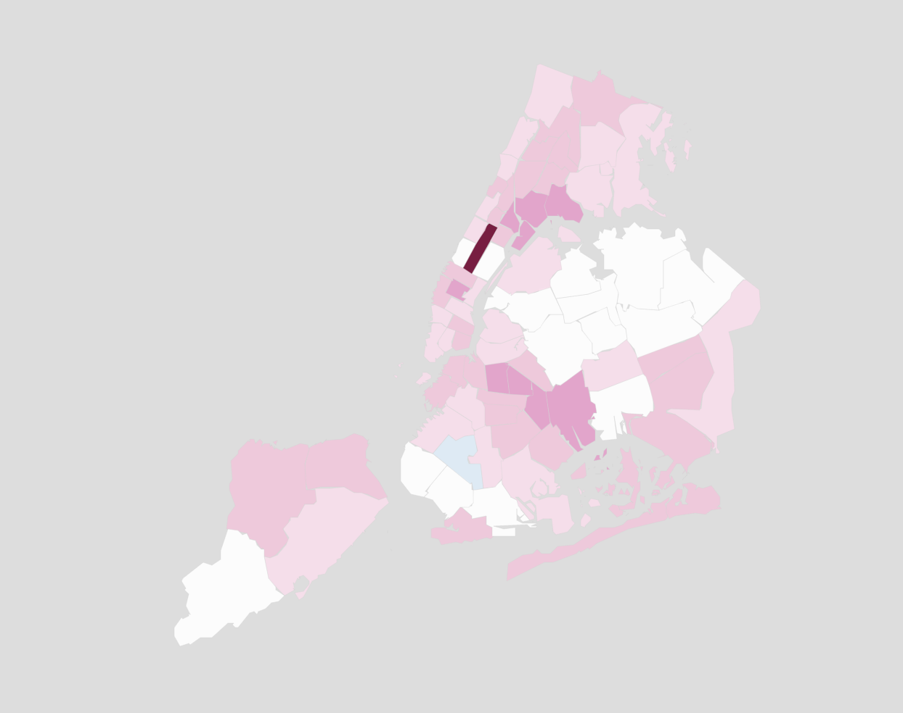

# Precinct Level Exploration of Civilian Complaints Against New York City Police Officers

*August 12, 2020 - Joy Yang*

```{r, cache=FALSE, include=FALSE}

set.seed(1000)

library(sf)
library(leaflet)
library(data.table)

# Utility functions and variables
color.groups = function(z,
			col = blues9, 
			zlim = c(min(z, na.rm = TRUE),
				 max(z, na.rm = TRUE))
			){
    breaks <- seq(zlim[1], zlim[2], length = length(col) + 1)
    zgroups <- cut(z, breaks = breaks,
		   include.lowest = TRUE)
    colLegend = col
    names(colLegend) = levels(zgroups)
    return(list(col = col[as.numeric(zgroups)], legend = colLegend))
}

grassgreens9 = c("#FBFFF7","#EBF7DE","#DBEFC6","#CAE19E",
	"#AED66B","#92C642","#71B521","#519C08","#306B08")
purples9 = c("#FBF7FF","#EBDEF7","#DBC6EF","#CA9EE1","#AE6BD6",
	"#9242C6","#7121B5","#51089C","#30086B")
golds9 = c("#FFFBF7","#F7EBDE","#EFDBC6","#E1CA9E","#D6AE6B",
	"#C69242","#B57121","#9C5108","#6B3008")
reds9 = c("#FFF7FB","#F7DEEB","#EFC6DB","#E19ECA","#D66BAE",
	"#C64292","#B52171","#9C0851","#6B0830")
seagreens9 = c("#F7FFFB","#DEF7EB","#C6EFDB","#9EE1CA","#6BD6AE",
	"#42C692","#21B571","#089C51","#086B30")

entropy = function(n){
	p = n/sum(n)
	p = p[p!=0]
	-sum(p*log(p))
}

# Read in shape file for plotting
# source: https://data.cityofnewyork.us/Public-Safety/Police-Precincts/78dh-3ptz
precinctsShp = st_read("PolicePrecincts/geo_export_61b2635b-d7ba-4227-9da7-ea8761e39fd4.shp")
precinctsLonLat = st_transform(precinctsShp, 4326)

# Read and format allegations data
# source: https://www.propublica.org/datastore/dataset/civilian-complaints-against-new-york-city-police-officers
allegations = read.csv("allegations_202007271729.csv", stringsAsFactors = FALSE)
allegations$ones = "01"
allegations$receivedMo =
	strptime(
		 apply(allegations[, c("year_received", "month_received", "ones")],
		       1, paste, collapse = "-"),
		 "%Y-%m-%d"
	)
allegations$closedMo =
	strptime(
		 apply(allegations[, c("year_closed", "month_closed", "ones")],
		       1, paste, collapse = "-"),
		 "%Y-%m-%d"
	)

# Read precincts population data
# source: https://johnkeefe.net/nyc-police-precinct-and-census-data
precinctPopulation = read.csv("nyc_2010pop_2020precincts.csv", stringsAsFactors = FALSE)
names(precinctPopulation)[1] = "precinct"

# Read NYPD police complaints data
# source: https://data.cityofnewyork.us/Public-Safety/NYPD-Complaint-Data-Historic/qgea-i56i
# because the data is really large, use pre-tabulated version
if(FALSE){
	complaints = fread("../NYPD_Complaint_Data_Historic.csv")
	regexDateFilter = grepl("20[12][0-9]$", complaints$RPT_DT)
	complaintsTally = table(complaints$ADDR_PCT_CD[regexDateFilter])
	save(complaintsTally, file = "complaintsTally.RData")
	rm(complaints)
}
load("complaintsTally.RData")

# Reformat allegations data by precinct
# Only keep allegations from 2010 on
dateFilter = as.Date(allegations$receivedMo) >= as.Date("2010-01-01")

allegationCategories = sort(unique(paste0(allegations$fado_type, ": ", allegations$allegation)))

allegationsByPrecincts =
	data.frame(do.call("rbind", by(allegations[dateFilter,],
				       allegations$precinct[dateFilter],
				       function(x){
					       with(x, 
						    {
							    list(precinct = unique(precinct),
								 allegations = length(unique(complaint_id)),
								 allegationDescription =
									 table(factor(tapply(paste0(fado_type, ": ", allegation),
											     complaint_id,
											     function(x){sample(x, 1)}),
										      levels = allegationCategories))
							    )
						    }
					       )
				       })), stringsAsFactors = FALSE)

allegationsByPrecincts[,c(1, 2)] = sapply(allegationsByPrecincts[,c(1, 2)], unlist)

# Attach population data to allegations by precinct
allegationsAndPopulation = merge(allegationsByPrecincts, precinctPopulation)
allegationsAndPopulation$complaints = as.numeric(complaintsTally[as.character(allegationsAndPopulation$precinct)])

```

This July, Propublica released a 
[database of over 12,000 closed allegations](https://www.propublica.org/datastore/dataset/civilian-complaints-against-new-york-city-police-officers) 
filed against NYPD officers with at least 
one substantiated allegation, and are still on the force as of June 2020.

While an officer-level analysis would be most interesting due to the nature of this data, because of the accusatory 
tone that such an analysis could easily take, we'll, for now, focus on a 
[precinct-level]( https://data.cityofnewyork.us/Public-Safety/Police-Precincts/78dh-3ptz) 
analysis of the data, and possibly return to an officer-level analysis at a later time.

One immediate question that comes to mind in considering precinct-level analyses is: "Do any precincts have more 
allegations than would be expected? Do any precincts have less allegations than would be expected?"

<div id="right" style="padding: 5px;">

</div>

To answer this question, we must first define what is "expected." As discussed in J124, if not normalized 
thoughtfully, choropleth maps can become simply representations of population density. To account for this, one 
approach might be to calculate the number of allegations per month 
[per 100,000 residents](https://johnkeefe.net/nyc-police-precinct-and-census-data); 
however, this metric 
highlights one particular precinct: Central Park. While in the last 10 years, there have only been 5 allegations 
issued from Central Park, because only 25 people claim to live within the precinct, the park appears to have an 
abnormally high number of rate of police allegations.

It appears, then, that the number of residents may then not be the most appropriate normalization factor. Instead, a 
more suitable factor could be the 
[number of complaints made to the NYPD](https://data.cityofnewyork.us/Public-Safety/NYPD-Complaint-Data-Historic/qgea-i56i) 
about crimes/suspicious activities within 
each precinct. This captures, in essence, a crime rate. Normalizing allegations about the NYPD by the complaints 
made to the NYPD would allow us to compare allegation rates given the frequency that police are called upon in 
various precincts.

And in order to keep the analysis more recent, only allegations made in the last 10 years (and complaints made to 
the NYPD in the last 10 years) are included in the visualization below.

It should be noted that because of the nature of this data, there is a major caveat: complaints made within the last 
10 years against officers no longer in the NYPD will not be included in this dataset.

```{r out.width = "100%", echo=FALSE, warning=FALSE, message=FALSE, cache=FALSE, eval=TRUE}

# Calculate a sensible complaint rate
allegationRates = allegationsAndPopulation$allegations / allegationsAndPopulation$complaints 
ok = unlist(allegationsAndPopulation$allegations) > 2

averageRate =  sum(allegationsAndPopulation$allegations[ok]) /
	sum(allegationsAndPopulation$complaints[ok])

LLR = allegationsAndPopulation$allegations  * log(averageRate / allegationRates) -
	(averageRate - allegationRates) * allegationsAndPopulation$complaints

LLR[allegationRates > averageRate] = - LLR[allegationRates > averageRate]

plotData = data.frame(
	precinct = allegationsAndPopulation$precinct,
	population = allegationsAndPopulation$P0010001,
	complaints = allegationsAndPopulation$complaints,
	allegations = allegationsAndPopulation$allegations,
	allegationRates = allegationRates,
	LLR = LLR
)

precinctsMerged = merge(precinctsLonLat, plotData)

allegationRateColors =
	color.groups(
		     log(precinctsMerged$allegationRates) - log(averageRate),
		     zlim = c(-1, 1) * max(abs(log(precinctsMerged$allegationRates) - log(averageRate))),
		     col = c(rev(blues9[-1]), "#FFFFFF", reds9[-1])
)

m.labels = lapply(paste("Precinct: ",precinctsMerged$precinct,
				" <br/>Allegations Per 1000 Complaints: ",
				round(precinctsMerged$allegationRates * 1000 * 100)/100,
				" <br/>Allegations (since 2010): ",
				round(precinctsMerged$allegations*100)/100,
				" <br/>Complaints (since 2010): ",
				round(precinctsMerged$complaints*100)/100,
				" <br/>Population (2010 Census): ",
				precinctsMerged$population,sep=""),
				htmltools::HTML)

m = leaflet(precinctsMerged) %>%         
      setMaxBounds(-74.3, 40.6, -73.6, 40.8)
m = m %>% addPolygons(
		  fillColor = allegationRateColors$col,
		  label = m.labels,
		  weight = 0.2,
		  opacity = 1,
		  color = "#D3D3D3",
		  fillOpacity = 0.9) %>%
	  	  addLegend(colors = c(reds9[7], blues9[7]), opacity = 1,
		  	    labels = c("Higher Allegations Per Complaints than Average",
					 "Lower Allegations Per Complaints than Average"),
			    title = NULL, position = "bottomright")
m

```

This map implies that there seems to be a spatial structure behind police allegation rates. Is this due to the 
nature of the New York neighborhoods/zoning? Or is this due to the police culture, or even individual police who 
may have high/low allegation rates? These questions will need further exploration through an officer-level 
analysis.

However, another question that arises is, "What types of allegations are common? Do allegation types follow a 
geographic structure as well?"

Overall, for this dataset, in the last 10 years, the most common allegations are:

```{r out.width = "100%", echo=FALSE, warning=FALSE, message=FALSE, cache=FALSE, eval=TRUE}

temp = do.call("rbind", allegationsByPrecincts$allegationDescription)
allegationCountsPerComplaint = sort(apply(temp, 2, sum), decreasing = TRUE)

topAllegations = data.frame(top_allegations = allegationCountsPerComplaint[1:5])
topAllegations$top_allegations = paste0(round(topAllegations$top_allegations /
					      sum(allegationCountsPerComplaint) * 100), "%")

knitr::kable(topAllegations)

```

We can additionally examine the most common allegation for each precinct, and scale the opacity according to the 
prevalence of the most common allegation as follows:

```{r out.width = "100%", echo=FALSE, warning=FALSE, message=FALSE, cache=FALSE, eval=TRUE}

# Examine most common allegations, along with the prevalence of the allegation
commonAllegations = sapply(allegationsAndPopulation$allegationDescription,
			   function(x){names(x)[which.max(x)]})

allegationColors = c(
		     "#bcbd22",
		     "#ff7f0e",
		     "#2ca02c",
		     "#17becf",
		     "#9467bd",
		     "#8c564b",
		     "#e377c2",
		     "#1f77b4",
		     "#d62728"
)
names(allegationColors) = sort(unique(commonAllegations))

# A couple approximation metrics for measuring the "diversity" of allegations
allegationEntropy = sapply(allegationsAndPopulation$allegationDescription, entropy)
allegationMultinomial = sapply(allegationsAndPopulation$allegationDescription, function(x){
				       sum(x)*log(1/length(x)) - sum(x) * entropy(x)
			    })
allegationTopPercentage = sapply(allegationsAndPopulation$allegationDescription, function(x){
					 x[which.max(x)]/sum(x)
			    })

allegationLegend = paste0("precinct: ", allegationsAndPopulation$precinct, "<br/>",
			  sapply(allegationsAndPopulation$allegationDescription, function(x){
			       topAllegations = sort(x[x!=0], decreasing = TRUE)
			       topAllegations = topAllegations[1:min(length(topAllegations), 3)]
			       paste0(round(topAllegations/sum(x) * 100), "% (",
				      topAllegations, "/", sum(x),") ",
				      names(topAllegations), collapse = "<br/>"
			       )
			    }))

plotData = data.frame(
	precinct = allegationsAndPopulation$precinct,
	allegations = allegationsAndPopulation$allegations,
	entropy = allegationEntropy,
	multinomial = allegationMultinomial,
	topPercentage = allegationTopPercentage,
	topAllegation = commonAllegations,
	legend = allegationLegend,
	stringsAsFactors = FALSE
)

precinctsMerged = merge(precinctsLonLat, plotData)

allegationsColors =
	color.groups(
		     precinctsMerged$entropy,
		     col = rev(blues9)
	)

nbins = 7
colorMatrix = sapply(allegationColors,function(x){
  colorRampPalette(c(x,"#FFFFFF"))(nbins+1)[-(nbins+1)]
})

multiAllegationColors = colorMatrix[cbind(as.numeric(cut(1-precinctsMerged$topPercentage,nbins)),
					  as.numeric(factor(precinctsMerged$topAllegation, colnames(colorMatrix)))
					  )]

m.labels = lapply(precinctsMerged$legend,
				htmltools::HTML)

m2 = leaflet(precinctsMerged) %>%         
      setMaxBounds(-74.3, 40.6, -73.6, 40.8)
m2 = m2 %>% addPolygons(
		  fillColor = multiAllegationColors,
		  label = m.labels,
		  weight = 0.2,
		  opacity = 1,
		  color = "#D3D3D3",
		  fillOpacity = 0.9) %>%
	  	  addLegend(colors = allegationColors, opacity = 1,
		  	    labels = names(allegationColors),
			    title = NULL, position = "topright")
m2

```

From the map above, there is some suggestion that allegation types may follow an underlying geographic structure. 
This again, this brings up the question of whether this may be due to the characteristics of neighborhood and 
crimes reported for that precinct, or whether this may be due to police behavior and the policing culture of the 
precinct.

This leaves many interesting further directions for exploration, a few additional questions we can answer with this 
data include, for example:

- Are officers who police similar precincts prone to similar allegations?
- Can the distribution of police allegations be explained by the distribution of crimes reported? (Is there a 
  defensible explanation for the means of policing employed?)
- What does a typical career trajectory of an NYPD officer look like? Do the complaints made against an officer 
  typically increase over time? Or do they decrease as an officer progresses up the chain of command?


